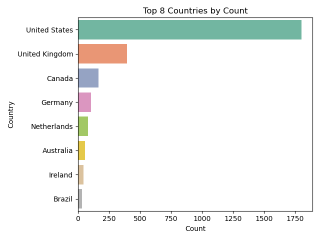

## Rapport d'analyse — Santé mentale dans la tech (2014–2023)

### Contexte et objectif
Ce projet analyse les enquêtes OSMI/mentales santé dans la tech afin de comprendre comment l'âge, le genre, le statut d'emploi, la taille d'entreprise et la présence d'avantages (benefits) sont associés à la recherche de traitement et à la connaissance des options de prise en charge. Les analyses ont été menées dans le notebook `Python.ipynb`.

### Données utilisées
- `survey-2014.csv`
- `mental-heath-in-tech-2016_20161114.csv`
- `OSMI Mental Health in Tech Survey 2017.csv`
- `mental-health-in-tech-2019.csv`
- `responses-2023.csv`

Les différentes années ont été fusionnées dans une table de travail commune (données « all years ») pour permettre des analyses agrégées.

### Préparation des données (principales opérations)
- Normalisation de la colonne `treatment` en catégories cohérentes (« Yes » / « No »).
- Nettoyage de `age` et filtrage des valeurs aberrantes: suppression des âges ≤ 11 ans et ≥ 100 ans.
- Regroupement/standardisation des libellés de `gender` (catégories Male / Female / Transgender / Other).
- Nettoyage de `care_options` (Yes / No / Don't know) pour l’analyse d’awareness.
- Nettoyage de `self_employed` (imputation des valeurs manquantes par « No », remapping 0/1 → No/Yes).
- Création de tranches d’âge (`age_range`) pour l’analyse par groupes d’âges.

### Analyses et visualisations
- Top 8 pays par volume de réponses:

  

- Distribution des âges (boxplot) sur l’ensemble des années:

  

- Âge et traitement:
  - Comparaison des distributions d’âge par statut de traitement (Yes/No) et par tranches d’âge.
  - Test du χ² d’indépendance exécuté entre `age_range` et `treatment` → association significative rapportée dans le notebook (ex.: Chi²(5) ≈ 21.68, p < 0.001).
  - Interprétation: les tranches 26–35 et 36–45 concentrent davantage de cas rapportant un traitement, en partie car ce sont les tranches les plus représentées.

- Genre et traitement:

  

- Genre et connaissance des options de prise en charge (`care_options`):

  

  Observation complémentaire (Readme): awareness plus élevée chez les femmes (≈ 38%) que chez les hommes (≈ 27%).

- Statut d’emploi (`self_employed`) et traitement:

  

- Taille d’entreprise (`no_employees`) et traitement:

  

- Avantages (« benefits ») par taille d’entreprise:

  

- Avantages et traitement:

  

### Principales observations
- Âge: association statistiquement significative avec le statut de traitement; les tranches 26–35 et 36–45 concentrent davantage de personnes déclarant un traitement. Cette différence reflète aussi la structure d’âge de l’échantillon.
- Genre: différences visibles dans la répartition du traitement et dans la connaissance des options de prise en charge; l’awareness apparaît plus élevée chez les femmes (≈ 38%) que chez les hommes (≈ 27%).
- Statut d’emploi: des différences de répartition de traitement existent entre self-employed et non self-employed.
- Taille d’entreprise: la répartition des traitements varie selon le nombre d’employés.
- Avantages (« benefits »): les visuels suggèrent une association entre la disponibilité des benefits et des taux plus élevés de traitement/awareness. Une validation statistique multivariée est recommandée.

### Limites et pistes suivantes
- Travailler en proportions plutôt qu’en seuls effectifs pour comparer les groupes.
- Contrôler les facteurs de confusion (année, pays, rôle, genre, etc.) via une régression logistique multivariée sur `treatment`.
- Quantifier les tailles d’effet (ex.: V de Cramér) et fournir des intervalles de confiance.
- Harmoniser encore les catégories (`gender`, `care_options`, `benefits`) et documenter précisément les mappings.
- Analyser l’hétérogénéité par année et par pays (effets de cohorte/contextuels).

### Fichiers générés (sorties principales)
- `top_8_countries_by_count.png`
- `age_distribution_merged_df.png`
- `gender_treatment_distribution.png`
- `gender_care_options_distribution.png`
- `self_employed_treatment_distribution.png`
- `no_employees_treatment_distribution.png`
- `benefits_by_company_size_distribution.png`
- `benefits_treatment_distribution.png`

Ces éléments synthétisent les étapes et résultats majeurs du notebook `Python.ipynb` et servent de base à des analyses statistiques plus poussées.
